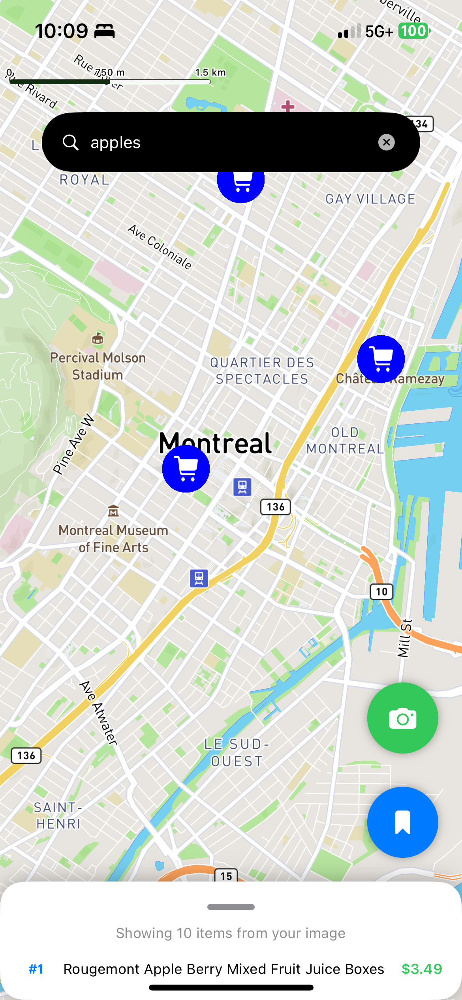
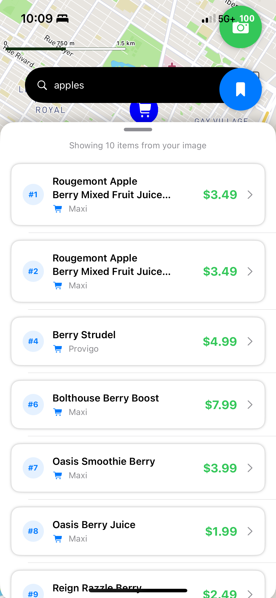

# Dealify

## Overview

Dealify simplifies grocery shopping by helping you find the best prices across multiple locations in Montreal. Instead of manually comparing prices, our platform does the research for you, ensuring you get the best deals effortlessly. With our real-time scanning feature, you can instantly check if a product is available at a lower price elsewhere by simply scanning its tag. Save money every week with minimal effort—let Dealify do the work for you!

<p align="center">
  
  
  
</p>

This repository contains a **full-stack application** with the following technologies:

- **Front-end:** SwiftUI (iOS application)
- **Backend API:** TypeScript (Node.js, NestJs)
- **Backend API:** Flask (Python)
- **Web Scraping:** Python (BeautifulSoup)

The application provides seamless integration between a **SwiftUI front-end**, a **TypeScript-based API**, a **Flask microservice**, and a **web scraping module** that gathers real-time data.

---

## Features

- ✅ **Smart Price Comparison:** Automatically compares grocery prices across multiple locations in Montreal
- ✅ **Instant Product Scanning:** Scan product tags to find the best available prices in real-time

---

## Collaborators

| Name            | GitHub Profile                                     |
| --------------- | -------------------------------------------------- |
| Kevin He        | [@kevinhe04](https://github.com/kevinhe04)         |
| Eddie Chen      | [@eddiechn](https://github.com/eddiechn)           |
| Nathan Audegond | [@NA29](https://github.com/NA29)                   |
| Hubert Khouzam  | [@HubertKhouzam](https://github.com/HubertKhouzam) |

---

## Installation

### Prerequisites

Ensure you have the following installed on your system:

- [Node.js](https://nodejs.org/en/) (for TypeScript server)
- [Python](https://www.python.org/) (for Flask and scraping scripts)
- [Xcode](https://developer.apple.com/xcode/) (for SwiftUI app)
- [PostgreSQL](https://www.postgresql.org/) or your preferred database

### Setup Instructions

#### 1️⃣ Clone the Repository

```sh
git clone https://github.com/HubertKhouzam/Dealify.git
cd Dealify
```

#### 2️⃣ Backend: TypeScript Server Setup

```sh
cd server
npm install
cp .env.example .env
npm run dev
```

#### 3️⃣ Backend: Flask API Setup

```sh
cd flask
pip install -r requirements.txt
cp .env.example .env
py app.py
```

#### 4️⃣ Web Scraping Module

```sh
cd scrape
pip install -r requirements.txt
```

Manually run the `.ipynb` file

#### 5️⃣ Front-end: SwiftUI App

Open `SwiftUIApp.xcodeproj` in **Xcode**, then run the project on a simulator or real device.

---

## API Documentation

### TypeScript Server Endpoints

| Method | Endpoint                | Description                           |
| ------ | ----------------------- | ------------------------------------- |
| `GET`  | `/items/`               | Fetch all items                       |
| `GET`  | `/items/:name`          | Fetch item by name                    |
| `GET`  | `/items/search/:search` | Search for items via Flask API        |
| `POST` | `/items/upload`         | Upload and process a CSV file         |
| `POST` | `/items/image`          | Upload an image and send to Flask API |

### Flask API Endpoints

| Method | Endpoint          | Description                                |
| ------ | ----------------- | ------------------------------------------ |
| `POST` | `/upload`         | Upload an image and generate a search term |
| `GET`  | `/search/<query>` | Perform a semantic search using BM25       |

---

## Environment Variables

Create a `.env` file in the **backend** directories using the provided `.env.example` file:

```sh
cp .env.example .env
```

Modify the `.env` file as needed with your specific credentials and settings.

**For TypeScript Server (`server-typescript/.env`)**:

```sh
PORT=5000
DATABASE_URL=your-database-url
JWT_SECRET=your-secret-key
```

**For Flask Server (`server-flask/.env`)**:

```sh
FLASK_APP=app.py
SECRET_KEY=your-secret-key
```

---
